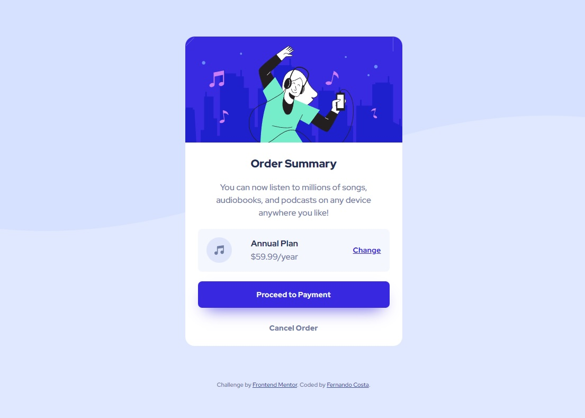

# Frontend Mentor - Order summary card solution

This is a solution to the [Order summary card challenge on Frontend Mentor](https://www.frontendmentor.io/challenges/order-summary-component-QlPmajDUj). Frontend Mentor challenges help you improve your coding skills by building realistic projects. 

## Table of contents

- [Overview](#overview)
  - [The challenge](#the-challenge)
  - [Screenshot](#screenshot)
  - [Links](#links)
- [My process](#my-process)
  - [Built with](#built-with)
  - [What I learned](#what-i-learned)
  - [Continued development](#continued-development)
- [Author](#author)

## Overview

### The challenge

Users should be able to:

- View the optimal layout depending on their device's screen size
- See hover states for interactive elements

### Screenshot




### Links

- [My solution](https://github.com/ffernandocosta/order-summary-component-main)
- [Live version](https://ffernandocosta.github.io/order-summary-component-main/)

## My process

### Built with

- Semantic HTML5 markup
- CSS custom properties
- Flexbox
- CSS Grid
- Mobile-first workflow


### What I learned

In this project I learned how to create simple hover effects for buttons changing their background color and text color as well. Also got to learn how to use grid and felx together on a layout and got to practice the use of variables in my css.

```html
<h1>Some HTML code I'm proud of</h1>
  <div class="order__plan">
    
    <div class="flex-group">
      <p class="plan-title">Annual Plan</p>
      <p>$59.99/year</p>
    </div>
    <button class="button__change-plan">Change</a>
  </div>
```
```css
.proud-of-this-css {
  
  .order__plan {
    display: grid;
    grid-template-columns: auto 1fr 1fr;
    gap: 1.3rem;
    background-color: var(--clr-neutral-100);
    padding: 1rem 1rem;
    border-radius: 0.5rem;
  }
}
```

### Continued development

I want to tackle more complex projects in the future and hopefully use some of JavaScript as well.


## Author

- GitHub - [Fernando Costa](https://github.com/ffernandocosta)